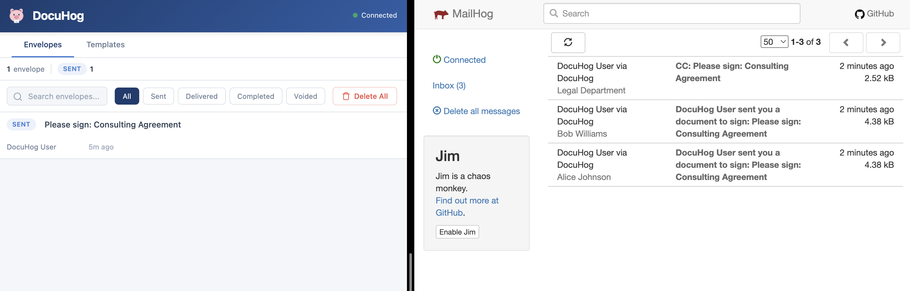
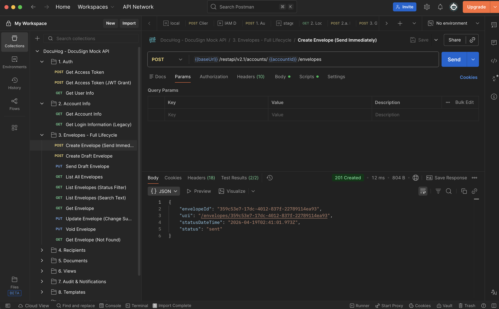
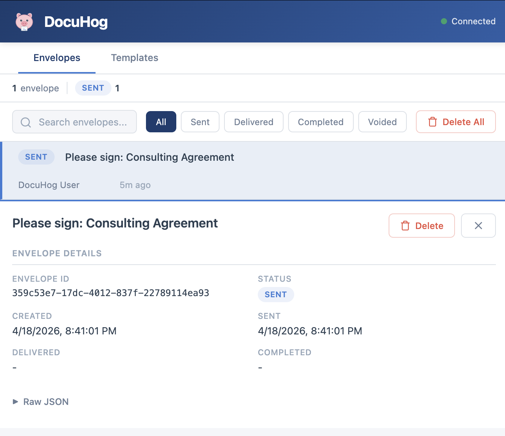
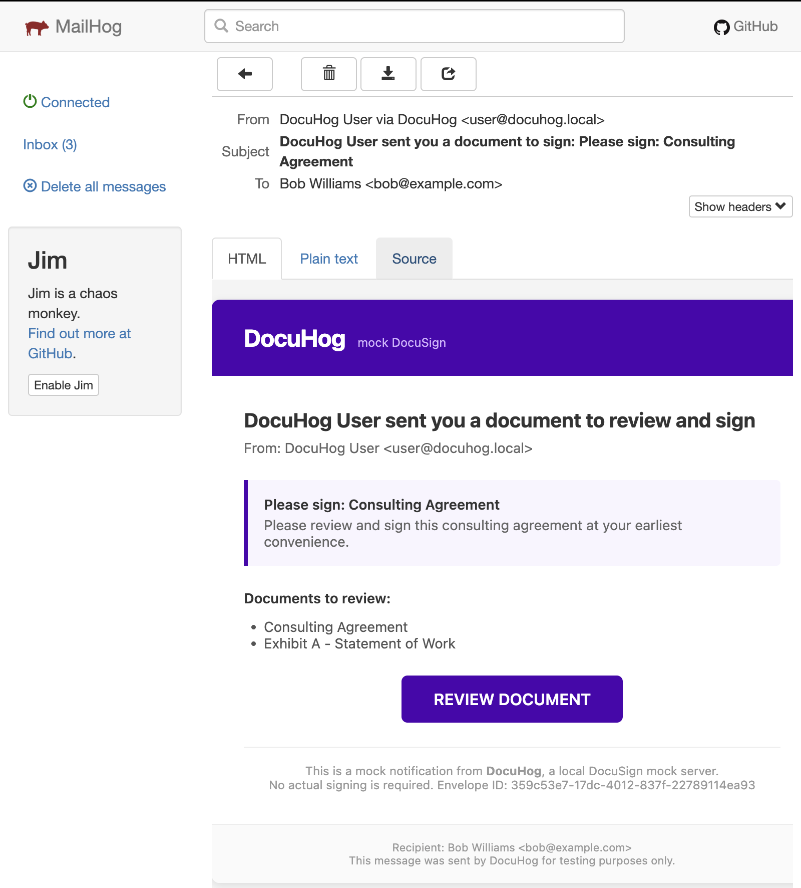

# DocuHog

**Like MailHog, but for DocuSign.**

[](LICENSE)
[](Dockerfile)
[](package.json)

---

## What is DocuHog?

DocuHog is a local mock server for the [DocuSign eSignature REST API](https://developers.docusign.com/docs/esign-rest-api/). If you've ever used [MailHog](https://github.com/mailhog/MailHog) to catch outgoing emails during development, DocuHog does the same thing for DocuSign API calls. Point your app at DocuHog instead of DocuSign's sandbox, and every envelope, template, and signing request is captured locally and viewable in a web UI -- no DocuSign developer account, no internet connection, no rate limits.



## Features

- **Drop-in replacement** -- change one URL and your app talks to DocuHog instead of DocuSign
- **Mock OAuth** -- `POST /oauth/token` accepts any credentials and returns a valid-looking JWT
- **Envelope capture** -- create, send, list, and inspect envelopes via the standard REST API
- **Template support** -- CRUD operations for templates
- **Web UI** -- browse captured envelopes at `http://localhost:8025`
- **SMTP integration** -- forward signing notification emails to MailHog, Mailtrap, or any SMTP server
- **JSON file storage** -- data persists to disk (ephemeral by default in Docker, volume-mountable)
- **Docker-ready** -- single container, or `docker compose up` with MailHog included
- **Zero configuration** -- works out of the box with sensible defaults

## Quick Start

You can be up and running in under two minutes. Pick whichever method suits you.

### Docker Compose (recommended)

This starts DocuHog alongside MailHog so envelope notification emails are captured too.

```bash
git clone https://github.com/docusign/docuhog.git
cd docuhog
docker compose up
```

- **DocuHog UI + API:** [http://localhost:8025](http://localhost:8025)
- **MailHog Web UI:** [http://localhost:8026](http://localhost:8026)

### Docker (standalone)

```bash
docker run -p 8025:8025 docuhog
```

Or use the standalone compose file (no MailHog):

```bash
docker compose -f docker-compose.standalone.yml up
```

### Node.js

Requires Node.js 22 or later.

```bash
git clone https://github.com/docusign/docuhog.git
cd docuhog
npm install
npm run dev
```

Open [http://localhost:8025](http://localhost:8025) in your browser.

## Pointing Your App at DocuHog

The only change your app needs is to set its DocuSign base URL to `http://localhost:8025/restapi`. No special credentials are required -- DocuHog's mock OAuth accepts anything.

### Node.js (DocuSign SDK)

```javascript
const docusign = require('docusign-esign');

const apiClient = new docusign.ApiClient();
apiClient.setBasePath('http://localhost:8025/restapi');
apiClient.addDefaultHeader('Authorization', 'Bearer any-token-works');
```

### Python (DocuSign SDK)

```python
from docusign_esign import ApiClient

api_client = ApiClient()
api_client.host = 'http://localhost:8025/restapi'
api_client.set_default_header('Authorization', 'Bearer any-token-works')
```

### Java (DocuSign SDK)

```java
ApiClient apiClient = new ApiClient("http://localhost:8025/restapi");
apiClient.addDefaultHeader("Authorization", "Bearer any-token-works");
```

### C# / .NET (DocuSign SDK)

```csharp
var config = new Configuration(new ApiClient("http://localhost:8025/restapi"));
config.AddDefaultHeader("Authorization", "Bearer any-token-works");
```

### Generic REST

For any HTTP client, just change the base URL:

```
# Instead of:
https://demo.docusign.net/restapi/v2.1/accounts/{accountId}/envelopes

# Use:
http://localhost:8025/restapi/v2.1/accounts/{accountId}/envelopes
```

### Getting a Mock Token

You can also obtain a mock JWT from DocuHog's OAuth endpoint. This is useful if your app's auth flow obtains a token before making API calls:

```bash
curl -X POST http://localhost:8025/oauth/token \
  -H "Content-Type: application/x-www-form-urlencoded" \
  -d "grant_type=urn:ietf:params:oauth:grant-type:jwt-bearer&assertion=anything"
```

DocuHog will return a response shaped like a real DocuSign OAuth token. Any credentials are accepted.

## Configuration

DocuHog is configured via environment variables. All have sensible defaults -- you can run it with zero configuration.

| Variable | Default | Description |
|----------|---------|-------------|
| `PORT` | `8025` | HTTP server port for the API and web UI |
| `SMTP_HOST` | *(none)* | SMTP server host for sending notification emails (e.g., `mailhog`, `smtp.mailtrap.io`) |
| `SMTP_PORT` | `1025` | SMTP server port |
| `SMTP_SECURE` | `false` | Use TLS for SMTP connection |
| `SMTP_USER` | *(none)* | SMTP authentication username |
| `SMTP_PASS` | *(none)* | SMTP authentication password |
| `DATA_DIR` | `./data` | Directory for persisted JSON data (set to `/data` in Docker) |
| `LOG_LEVEL` | `info` | Logging level (`debug`, `info`, `warn`, `error`) |
| `UI_PORT` | same as `PORT` | Web UI port, if you want it on a separate port |

For detailed configuration examples (SMTP providers, storage options, logging), see [docs/CONFIGURATION.md](docs/CONFIGURATION.md).

## API Compatibility

DocuHog mocks the following DocuSign eSignature REST API endpoints:

### Authentication

| Method | Endpoint | Description |
|--------|----------|-------------|
| `POST` | `/oauth/token` | Issue mock OAuth tokens (accepts any credentials) |

### Envelopes

| Method | Endpoint | Description |
|--------|----------|-------------|
| `POST` | `/restapi/v2.1/accounts/{accountId}/envelopes` | Create an envelope |
| `GET` | `/restapi/v2.1/accounts/{accountId}/envelopes` | List envelopes |
| `GET` | `/restapi/v2.1/accounts/{accountId}/envelopes/{envelopeId}` | Get envelope details |
| `PUT` | `/restapi/v2.1/accounts/{accountId}/envelopes/{envelopeId}` | Update an envelope |

### Templates

| Method | Endpoint | Description |
|--------|----------|-------------|
| `POST` | `/restapi/v2.1/accounts/{accountId}/templates` | Create a template |
| `GET` | `/restapi/v2.1/accounts/{accountId}/templates` | List templates |
| `GET` | `/restapi/v2.1/accounts/{accountId}/templates/{templateId}` | Get template details |

### Recipients

| Method | Endpoint | Description |
|--------|----------|-------------|
| `POST` | `/restapi/v2.1/accounts/{accountId}/envelopes/{envelopeId}/views/recipient` | Create recipient view (signing URL) |

### Accounts

| Method | Endpoint | Description |
|--------|----------|-------------|
| `GET` | `/restapi/v2.1/accounts/{accountId}` | Get account information |

### Internal / UI API

These endpoints power the DocuHog web UI and are not part of the DocuSign API:

| Method | Endpoint | Description |
|--------|----------|-------------|
| `GET` | `/api/v1/health` | Health check |
| `GET` | `/api/v1/envelopes` | List all captured envelopes (for the UI) |

For full request/response examples, see [docs/API.md](docs/API.md).

A [Postman collection](postman/DocuHog.postman_collection.json) is included with 36 pre-built requests covering every endpoint.



## Web UI

Open [http://localhost:8025](http://localhost:8025) in your browser to see the DocuHog web UI. It shows:

- A list of all captured envelopes with their status, recipients, and timestamps
- Envelope details including the full JSON payload your app sent
- Quick overview of recent activity



The web UI is served directly by the DocuHog Express server -- there is nothing extra to install or configure.

## Using with MailHog

When DocuHog "sends" an envelope, it can forward notification emails to an SMTP server. The default `docker-compose.yml` pairs DocuHog with [MailHog](https://github.com/mailhog/MailHog) so those emails are captured locally too:

```bash
docker compose up
```

- DocuHog captures your API calls at [http://localhost:8025](http://localhost:8025)
- MailHog captures the notification emails at [http://localhost:8026](http://localhost:8026)

This gives you a complete local testing loop: your app sends an envelope through DocuHog, DocuHog fires a notification email to MailHog, and you can inspect both the API payload and the email without anything leaving your machine.



To use a different SMTP provider (Mailtrap, SendGrid, Gmail SMTP, etc.), see [docs/CONFIGURATION.md](docs/CONFIGURATION.md).

## Limitations

DocuHog is a mock server for testing, not a full DocuSign reimplementation. Be aware of the following:

- **No signing ceremony** -- there is no interactive signing UI. Envelopes are accepted and their status is updated, but recipients do not actually sign documents.
- **No real PDF generation** -- DocuHog does not generate, merge, or manipulate PDF documents.
- **No webhook/Connect notifications** -- DocuSign Connect (webhook callbacks) are not implemented.
- **No PowerForms, Notary, or advanced features** -- only the core envelope, template, and recipient APIs are mocked.
- **No conditional recipients or routing** -- envelope routing logic is not simulated.
- **Simplified status transitions** -- envelopes move from `created` to `sent` to `completed` without realistic intermediate states.
- **No document download** -- `GET .../documents/{documentId}` is not implemented.
- **Single-user** -- there is no multi-user or permission simulation.
- **No rate limiting** -- DocuHog does not simulate DocuSign's API rate limits.

If your tests depend on any of these features, you will need the [DocuSign developer sandbox](https://developers.docusign.com/docs/esign-rest-api/sdks/) for those specific scenarios.

## Contributing

Contributions are welcome. Please see [CONTRIBUTING.md](CONTRIBUTING.md) for development setup, coding standards, and the PR process.

## License

[MIT](LICENSE)
